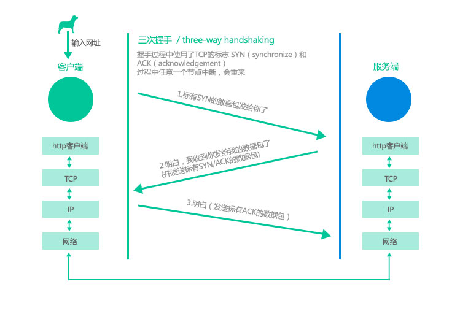

# 来一场实战，ajax和操作dom

## 什么是ajax

> Ajax 即“Asynchronous Javascript And XML”（异步 JavaScript 和 XML），是指一种创建交互式、快速动态网页应用的网页开发技术，无需重新加载整个网页的情况下，能够更新部分网页的技术。
> 通过在后台与服务器进行少量数据交换，Ajax 可以使网页实现异步更新。这意味着可以在不重新加载整个网页的情况下，对网页的某部分进行更新。

我的理解比较直接一些，就是向服务端发送数据或者从服务端获取数据。

## ajax请求类型与RESTful API

ajax请求类型一般分为4类， `POST` `GET` `PUT` `DELETE` 。一般使用post和get。
当前后端完全分离以后，服务端只提供ajax接口，一般操作类型就是增改查删（CURD）
假设我们数据库里有一张User表，我们根据表对象模型User，按照restful规范设计的接口应该是这样的：
新增用户:[POST] /users
修改用户:[PUT] /users/id
删除用户:[DELETE] /users/id
查找全部用户:[GET] /users
这样ajax的请求类型就和接口的类型对应起来了，而且非常清晰。

当然不一定非要这么用，只是说这么用比较合适。

## 发送ajax请求的方式

1. axios 【插件】
2. jQuery的ajax 【插件】
3. ES6中的 fetch
4. XMLHttpRequest对象

上面的两个插件非常好用，一般情况下我们无需用原生的js去实现，使用插件更加方便。用原生的js来写demo只是为了更好的理解过程。

## 了解一下Promise

在这个教程里面只说基础的用法，更深入的部分自行学习。ajax是一个典型的异步请求，啥叫异步呢？一般来说代码是一行一行执行，理论上来说是执行完第一行再执行第二行，这个就叫“同步”；如果第一行是异步的话，就是说在执行第二步的时候，第一步并没有执行完成。为了在第二步中能使用第一步中的结果，最早的方式是使用回调，就是把第二步当成一个函数，传给第一步，等第一步执行完成在执行这个函数。如果异步的过程很多的时候，就歇菜了，代码基本很很难阅读和理解，这个就是所谓的“回调地狱”。所以Promise能比较优雅的解决这个问题。

```javascript
// 用回调的方式
function read (cb) {
  let a = 1
  setTimeout(() => { // 2秒后完成操作
    a = 30
    if (cb) {
      cb(a)
    }
  }, 2000)
}
read((num) => {
  console.log(num)
})

// 用promise的方式
function readPromise () {
  let a = 1
  return new Promise((resolve) => {
    setTimeout(() => { // 2秒后完成操作
      a = 30
      resolve(a)
    }, 2000)
  })
}
readPromise().then(num => {
  console.log(num)
})
```

附加说一下，高频面试题：
Promise.all() 可以用来一次执行多个异步任务
Promise.race() 获得先返回的结果

## 原生的JS来写一个请求的范例

来一个to do list

```html
<!DOCTYPE html>
<html>
  <head>
    <title>to do list</title>
  </head>
  <body>
    <div>
      <ul id="to-do-list"></ul>
      <button id="add">添加</button>
    </div>
    <script>
      const id = 'to-do-list'
      const container = document.querySelector(`#${id}`)
      const btn = document.querySelector('#add')
      // ajax请求方法
      const ajax = (method = 'GET', url, data = {}) => {
        return new Promise((resolve, reject) => {
          const xhr = new XMLHttpRequest()
          // 请求成功回调函数
          xhr.onload = e => {
            resolve(JSON.parse(xhr.response)) // 将服务端返回的数据返回
          }
          // 请求出错
          xhr.onerror = e => {
            // 返回错误
            reject({
              code: -1,
              msg: '请求出错'
            })
          }
          // 请求超时
          xhr.ontimeout = e => {
            // 返回错误
            reject({
              code: -2,
              msg: '请求超时'
            })
          }
          xhr.open(method, url, true);
          xhr.send(data)
        })
      }
      // 获取列表
      ajax('GET', 'http://yapi.totonoo.com/mock/11/list').then(res => {
        // 这里是成功后执行的操作
        let html = ''
        res.data.forEach(item => {
          // 拼接字符串
          html += `<li><label><input type="checkbox"> ${item.title}</label></li>`
        })
        // 将拼接好的字符串插入到指定的位置
        container.innerHTML = html
      }).catch(err => {
        // 这里是失败后执行的操作
        alert(err.msg)
      }).finally(() => {
        // 完成后执行，不管成功或者失败，只要这一次请求完成了
          console.log('done)
      })
      // 添加事件
      btn.addEventListener('click', () => {
        // 表单参数
        const formData = new FormData()
        formData.append('username', 'lurenjia');
        ajax('POST', 'http://yapi.totonoo.com/mock/11/add', formData).then(res => {
          // 创建DOM
          const item = document.createElement('li')
          // 插入内容
          item.innerHTML = '<label><input type="checkbox"> 新增的</label>'
          // 在指定位置的最后插入创建的dom
          container.appendChild(item)
        }).catch(err => {
          alert(err.msg)
        })
      })
    </script>
  </body>
</html>
```

PUT、DELETE跟上面的类似，可以自己尝试去弄一下，这里就到此为止。

## http请求的过程详解

这个实际上就是描述，从用户从浏览器敲入网址之后回车，到浏览器显示页面的过程。


## 如何解决跨域问题

为什么会有跨域的问题？浏览器为了安全，使用同源策略导致了跨域。如果缺少了同源策略，浏览器很容易受到XSS、CSFR等攻击。所谓同源是指"协议+域名+端口"三者相同，即便两个不同的域名指向同一个ip地址，也非同源。
同源策略限制的表现（网上复制的）

> 1. Cookie、LocalStorage 和 IndexDB 无法读取
> 2. DOM 和 Js对象无法获得
> 3. AJAX 请求不能发送

一般来说前端最常见的表现就是AJAX 请求不能发送，1和2一般没有人在意，也不会有人这么做。

常用解决跨域的方法：

1. Nginx反向代理
2. Node中间代理
3. CORS
4. document.domain + iframe

推荐顺序从上到下，如果前端使用Node提供http服务，推荐使用第二种方式。3依赖于后端，4我基本已经不怎么用了。
