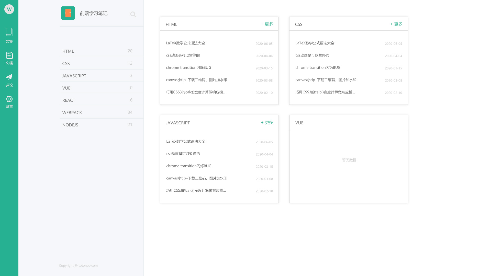
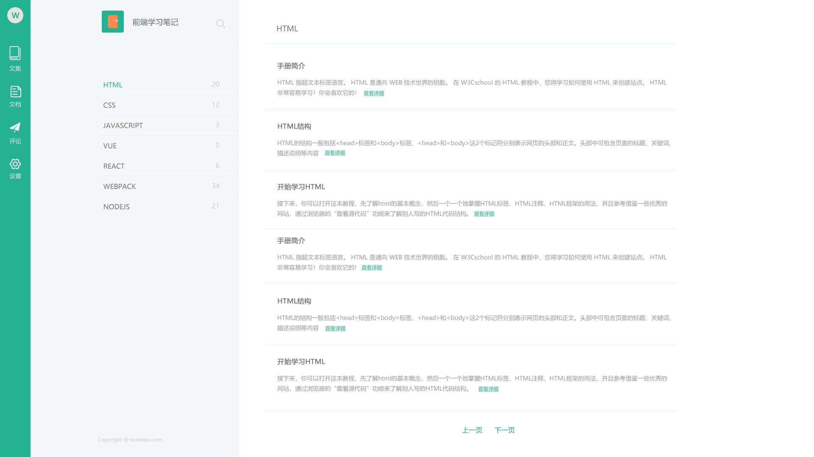
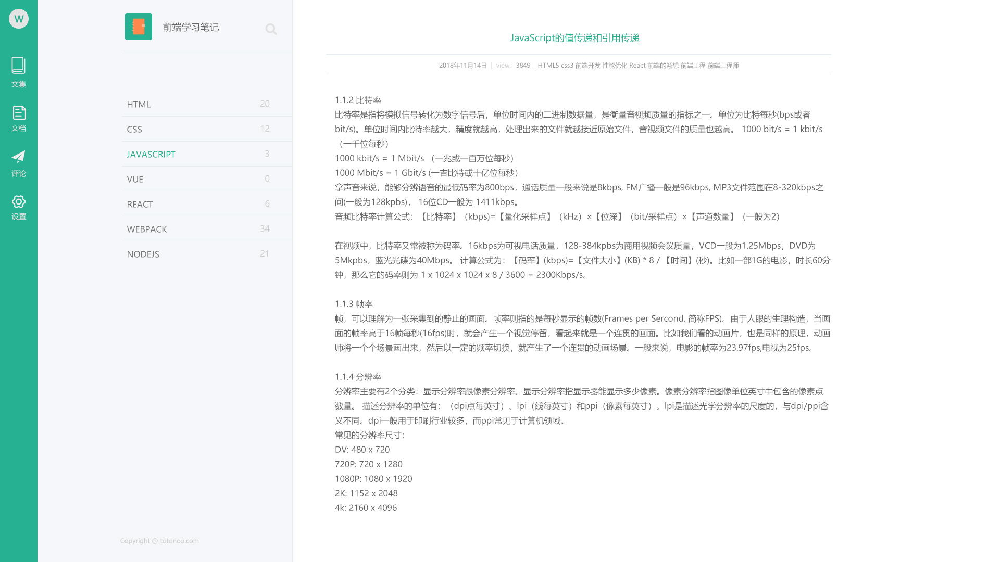
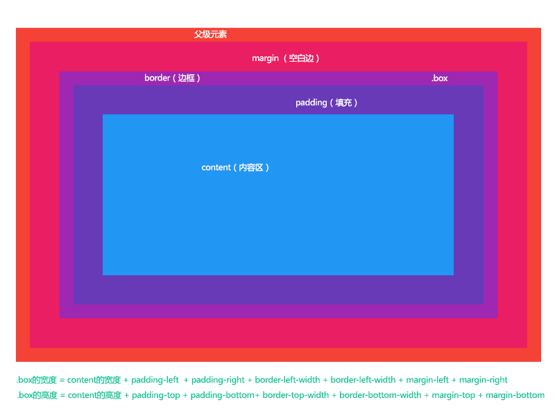

# 如何用css和html制作一个页面 - 布局

## 首先先确立一个目标：做一个博客模板


博客模板一般包含3个页面，首页，文章列表，文章详细页，我自己做了一个简单的页面，如下图所示：





我们先观察这3张图片，找到共同的部分，尽可能的多一些复用。很明显每张图片都是三种颜色分成3部分。从左到右，分别是：绿色、灰色、白色。实际是内容不同的部分就是最右侧白色的部分。所以确定是 `左中右` 三栏布局。


先找一个文件夹建立项目，为了简单，我在桌面建立了一个文件夹 `blog` ，里面文件结构如下：
```
|-- blog
    |-- assets
        |-- images // 图片文件
        |-- scripts // JS文件
        |-- styles // css文件
            |-- article.css // 文章页样式
            |-- global.css // 全局样式
            |-- index.css // 首页样式
            |-- list.css // 列表页样式
    |-- article.html // 文章
    |-- index.html // 首页
    |-- list.html // 列表
```
文件建好之后，开始编辑代码，处理第一个页面 `首页` 。
index.html插入初始结构：
```html
<!DOCTYPE html>
<html lang="en">
  <head>
    <meta charset="utf-8">
    <meta http-equiv="X-UA-Compatible" content="IE=edge">
    <meta name="viewport" content="width=device-width,initial-scale=1.0">
    <link rel="icon" href="/favicon.ico">
    <title>首页 - 我的博客</title>
    <meta name="keywords" content="我的博客"/>
    <meta name="description" content="我的博客简介。"/>
    <link href="assets/styles/global.css" rel="stylesheet" type="text/css"> <!-- 引入全局css -->
    <link href="assets/styles/index.css" rel="stylesheet" type="text/css"> <!-- 引入当前页面css -->
  </head>
  <body>
    <div class="layout">
      <div class="left">left</div>
      <div class="center">center</div>
      <div class="right">right</div>
    </div>
  </body>
</html>
```
因为布局是要复用的部分，所以跟布局相关的css我们写在 `global.css` 中。因为css3已经出来很久了，大部分浏览器也支持的比较好，所以我们先用css3的方式来布局，代码如下：
```css
@charset "utf-8";

html, body {
	width: 100%; /* 这里是必须的 */
	height: 100%; /* 这里是必须的 */
	margin: 0;
	padding: 0;
}

.layout {
	width: 100%;
	height: 100%;
	display: flex; /* css3 flex 关键点 */
}
.left {
	width: 72px;
	background-color: #26b192;
}
.center {
	width: 489px;
	border-right: 1px #e6ecf1 solid;
	background-color: #f5f7f9;
}
.right {
	flex: 1; /* 将剩余的宽度都给到.right */
}
```
问题1：宽度和高度100%的规则是怎么样的？
宽度和高度的100%是相对当前元素的父级来说， `.layout` 的父级就是 `body` ， `body` 的父级就是 `html` ，如果父级没有宽度和高度，对应的100%也就没有高度和宽度，可以删除上面代码的第四行和第五行，验证一下。


问题2： `.center` 的实际宽度是多少？
这里就要引入一个概念就是是 `CSS盒子模型` 。CSS盒子模型其实就是描述的是一个元素在页面中所占用的位置或者说是占用的面积有多大。

css3中，如果显式的设置了 `box-sizing: border-box;` ，那么.box的宽度和高度将不在包含padding和border，如：
```css
.box { 
  width: 100px;
  height: 100px; 
  border: 10px #26b192 solid; 
  padding: 20px; 
  margin: 30px; 
  box-sizing: border-box; 
}
/* box所占用的宽就是100 + 30 + 30 = 160px，高也是100 + 30 + 30 = 160px */

.box { 
  width: 100px;
  height: 100px; 
  border: 10px #26b192 solid; 
  padding: 20px; 
  margin: 30px;
}
/* box所占用的宽就是100 + 20 + 20 + 10 + 10 + 30 + 30 = 220px，高也是100 + 20 + 20 + 10 + 10 + 30 + 30 = 220px */
```
## 使用float方式来布局
```css
@charset "utf-8";

html, body {
	width: 100%;
	height: 100%;
	margin: 0;
	padding: 0;
}

.layout {
	width: 100%;
	height: 100%;
	float: left;
	clear: both;
}
.left {
	width: 72px;
	background-color: #26b192;
	float: left;
	height: 100%;
}
.center {
	width: 489px;
	border-right: 1px #e6ecf1 solid;
	background-color: #f5f7f9;
	float: left;
	height: 100%;
}
.right {
	float: right;
	height: 100%;
}
```
可以对比下2次的代码，实现的效果差不多，但是css2的方式是有缺陷的，.right的宽度不好控制。如果要保证3块一直在一行，需要用position来实现。


缺陷1：BFC(Block Formatting Context)，这个是高频面试题
当float值为left、right时，会触发BFC模式，表现为，父级高度塌陷，margin重叠等问题。


缺陷2：.right的宽度不好控制
各种客户端屏幕大小不一样，虽然left和center的宽度是固定，总宽度不定，所以.right宽度也就不固定


## 用position的方式来布局


这些页面有一个典型的表现，也就是left和center的高度是固定的，跟屏幕一样高，只有right部分的高度不固定，可能长可能短。如下：
```css
@charset "utf-8";

html, body {
	width: 100%;
	height: 100%;
	margin: 0;
	padding: 0;
}

.layout {
	width: 100%;
	height: 100%;
	position: relative;
}
.left {
	width: 72px;
	background-color: #26b192;
	float: left;
	height: 100%;
}
.center {
	width: 489px;
	border-right: 1px #e6ecf1 solid;
	background-color: #f5f7f9;
	float: left;
	height: 100%;
}
.right {
	position: absolute;
	word-break: break-all;
	left: 562px;
	top: 0;
}
```
## 总结
综合上面的来看，最简洁的是css3的布局方式。但是低版本浏览器不兼容。如果不考虑兼容问题，建议直接使用css3方式来布局。现在大部分的已经没有兼容性的要求了，但是政府网站，机关网站可能会有需求。
