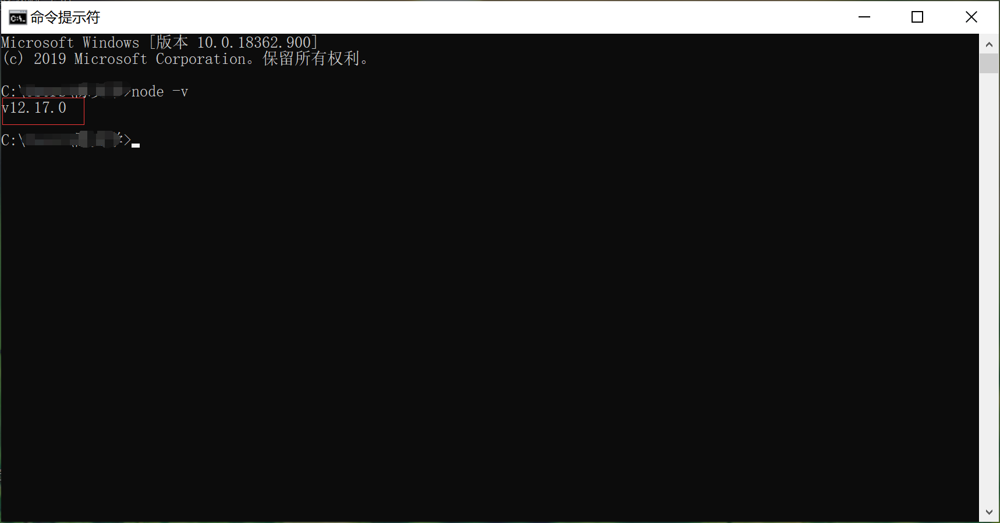
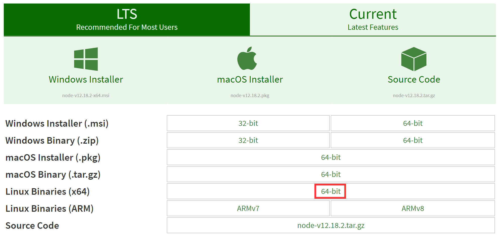
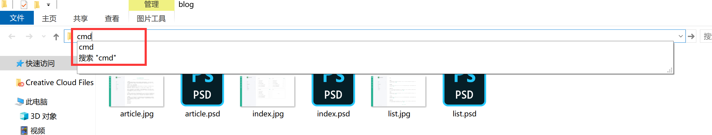

# NODE搭建基础开发环境

本来在这里不想引入node，但是没有办法，node在前端开发的过程中，已经是绕不过去的一个问题。用对应的脚手架工具可以帮助节省很多的开发成本。比如我们在前面几节里面，修改了页面内容，必须要在浏览器手动刷新才可以看到修改后的效果。如果我们使用 `Browsersync` 之后，就无需手动刷新，修改自动同步。
## window系列安装NODE


- 先去官方网站下载安装包 [https://nodejs.org/en/](https://nodejs.org/en/) 建议选择LTS版本
- 双击安装包，直接下一步，点完成就行了
- 然后在cmd（自行百度“如果打开window的cmd”）窗口里面输入 `node -v` 如果能显示对应的版本号，证明安装成功了。截图


## centos 7 上安装node
这里讲一下源码安装，其他方式可以自行搜索。
去官网下载对应的安装包：
[nodejs下载地址](https://nodejs.org/en/download/)

依次执行命令：
```shell
wget https://nodejs.org/dist/v12.18.2/node-v12.18.2-linux-x64.tar.xz
// 解压
xz -d node-v12.18.2-linux-x64.tar.xz
tar -xvf node-12.18.2-linux-x64.tar

// 进入目录编译安装 (有可能要安装相关依赖: sudo yum install gcc gcc-c++)
cd node-12.18.2
./configure
make
sudo make install

// 查看版本（测试安装是否成功）
node -v
```
## mac安装自行搜索把，没设备


## 实现一个简单的前端开发环境


装好了node之后，用 `Browsersync` 跑一个简单的http服务，Browsersync很好用，对前期学习html和css很有用，又不复杂。如果开发正式的项目，将会讲解 `webpack` 。


现在找到一个目录，在目录的地址栏里面输入cmd，就可以直接呼出cmd窗口，并锚定到这个目录。


依次执行命令：
```shell
// 创建demo目录
mkdir demo
cd demo
npm init
// 根据提示一步步填写即可 创建完成以后，目录中会有一个 package.json 的文件
// --registry https://registry.npm.taobao.org 不是必须，国内使用淘宝源会比较快
npm install browser-sync --save-dev --registry https://registry.npm.taobao.org
// 等待安装完成
```
在根目录下新建一个index.html文件，随便输入一些内容。
将package.json变成
```json
{
  "name": "demo",
  "version": "1.0.0",
  "description": "",
  "main": "index.js",
  "scripts": {
	"dev": "browser-sync start --server --files ./",
    "test": "echo \"Error: no test specified\" && exit 1"
  },
  "author": "",
  "license": "ISC",
  "devDependencies": {
    "browser-sync": "^2.26.7"
  }
}
```
然后在cmd的窗口中执行
`npm run dev` 
会打开你本地默认的浏览器，并访问[http://localhost:3000/](http://localhost:3000/)，页面中展示的就是你在index.html中输入的内容。
更神奇的是，此时你打开 `index.html` 修改内容并保存，不用刷新修改会自动同步。
cmd窗口中，有一个“External”，如果手机和电脑在同一个wifi下，用手机访问这个地址，是同步的，更改也是同步的。


不要指望这就学会了node，这只是用node来帮助你学习得更流畅一些。
