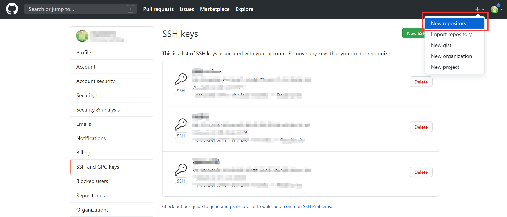
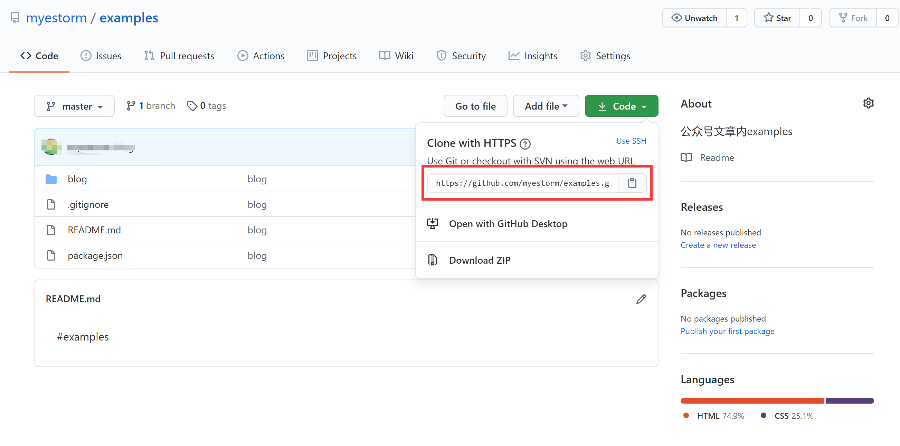
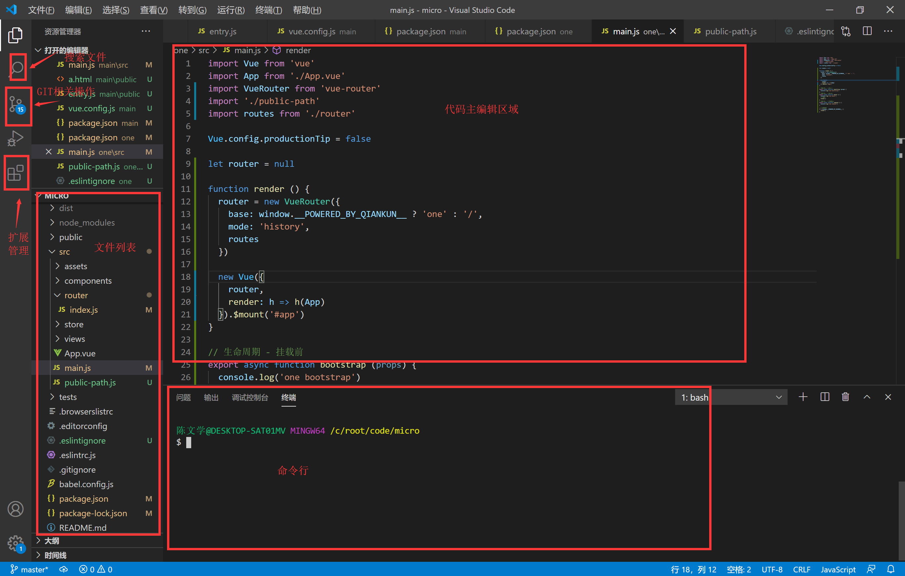

# 如何使用Visual Studio Code和GIT

工欲善其事，必先利其器。VSCODE是前端开发者的不二选择。


Git是目前世界上最先进的分布式版本控制系统，但是为什么要使用GIT？
在开发项目的时候，我们会不断地去修改代码。但是有时候可能会改错，或想回到某一个时间点，想查看某一个时间点的代码，如果没有版本控制器，我们需要不断地定时备份代码。显然这样很麻烦，而且备份也不一定好用， 内容重复，无法对比区别。


## window安装GIT

1. 下载GIT，window安装包 [https://git-scm.com/downloads](https://git-scm.com/downloads)。
1. 双击，不停下一步就可以了。
1. 安装完成之后，在桌面点击鼠标右键，会出现2个选项：Git GUI Here和Git Bash Here。GUI是图形操作界面，Bash是命令行模式。点击“Git Bash Here”会出现一个黑框框，输入 `node -v` 可以查看node的版本。实际功能与cmd相似。输入 `git --version` 可以查看当前GIT版本。


## 如何结合github.com使用GIT

1. 先去github注册一个账号，[https://github.com/](https://github.com/)。
1. 新建一个仓库
1. 复制仓库地址
1. 点击右键，点击“Git Bash Here”输入命令
```shell
git clone https://github.com/myestorm/examples.git
# 完成后会出现 examples 的文件夹
cd examples
touch filename.txt # 创建文件
vim filename.txt # 编辑文件 随意输入一些内容 按esc键 输入 :wq 保存文件
git add . # 缓存所有的修改
git commit -m "add filename" # 提交变更，引号内是 提交理由
git push # 推送变更 回到github的网站，刚刚添加的文件就提交上去了
```
基本用法已经搞定。回头有空整理一下常用的一些git用法。


## VS CODE window安装

1. 先去下载安装包，[https://code.visualstudio.com/](https://code.visualstudio.com/)。
1. 基本也是一路下一步。
1. 列举一下常用的扩展：简体中文语言包，Beautify（代码美化），ESLint（JS语法检查）等，扩展.vue后缀等，一般来说，文档打开，未识别的会自动提示，直接点击安装即可。
1. 


## 结语
平常都是使用window居多，mac自行搜索。教程也写得简单，主要是推荐一下2个工具，在后面的过程中会通畅一些。这2个工具基本是前端高频率使用的工具，能搞定所有的前端开发需求了。
