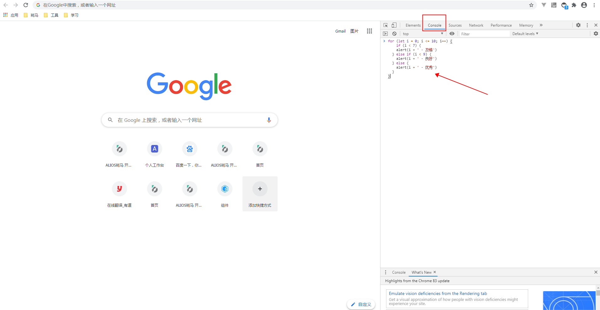

# JAVASCRIPT快速入门

## 基本语法
```javascript
let a = 1; // 定义变量 行末的分号可写可不写，看个人习惯
const b = 'JS'; // 定义常量
var v = 'var'; // 定义变量，这个在ES6里面已经弱化了，很少用了
let c = '';

// 条件判断
if (a === 1) { // 如果
	c = 'one'
} else if (a === 2) { // 如果
	c = 'two'
} else { // 否则
	c = 'none'
}

// 循环
const arr = [11, 22, 33, 44]
for (let i = 0; i < arr.length; i++) {
  console.log(arr[i])
}

// 对象取值
const obj = {
  name: "moon",
  age: 12
}
const key = 'name'
console.log(obj.name) // 输出moon
console.log(obj[key]) // 输出moon

// 数组取值
const arr = ['a', 'b', 'c']
console.log(arr[0]) // 输出 a 索引从0开始 a=>0,b=>1,c=>2​
```
## 数据类型


Number（数字）、String（字符）、Boolean（布尔）、Null（空）、Undefined、Symbol、Object（对象）
Tips：Boolean就只有2个值“true(真)”和“false(假)”；Object下还有“Array”、“Function”；Symbol表示独一无二的值。


## 变量


变量的概念基本上和初中代数的方程变量是一致的，只是在计算机程序中，变量不仅可以是数字，还可以是任意数据类型。
变量在JavaScript中就是用一个变量名表示，变量名是大小写英文、数字、$和_的组合，且不能用数字开头。变量名也不能是JavaScript的关键字，如if、while等。申明变量见上面的代码。


## JS运行过程


JS运行必须有环境，要么是浏览器，要么是node。前端所说的JS一般代指在浏览器环境运行。
运行一段js代码运行会经历2个过程：编译然后再执行。


简单说一下编译的过程：

1. 分词/词法分析（Tokenizing/Lexing）这个过程会将由字符串组成的字符串分解成（对编程语言来说）有意义的代码块，这些代码块被称为词法单元（token）
1. 解析/语法分析（Parsing）这个过程是将词法单元流（数组）转换成一个由元素逐级嵌套所组成的代表了程序语法结构的树（抽象语法树，Abstract Syntax Tree, AST）
1. 代码生成 将AST转换成可执行代码的过程


## 结尾


掌握了上面的内容，就等于学会了汉语拼音，知道怎么和计算机打交道了。一段代码结尾，0-6弹出“及格”，7-8弹出“良好”，9-10弹出“优秀”。
```javascript
for (let i = 0; i <= 10; i++) {
	if (i < 7) {
  	alert(i + ' - 及格')
  } else if (i < 9) {
  	alert(i + ' - 良好')
  } else {
  	alert(i + ' - 优秀')
  }
}
```
打开chrome浏览器，按F12 打开开发者工具，运行代码试试。粘贴代码，敲回车键。

